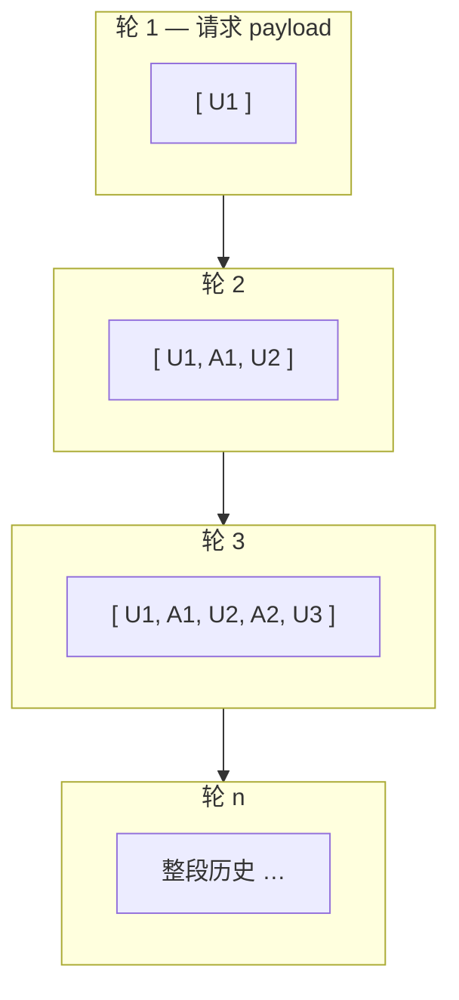
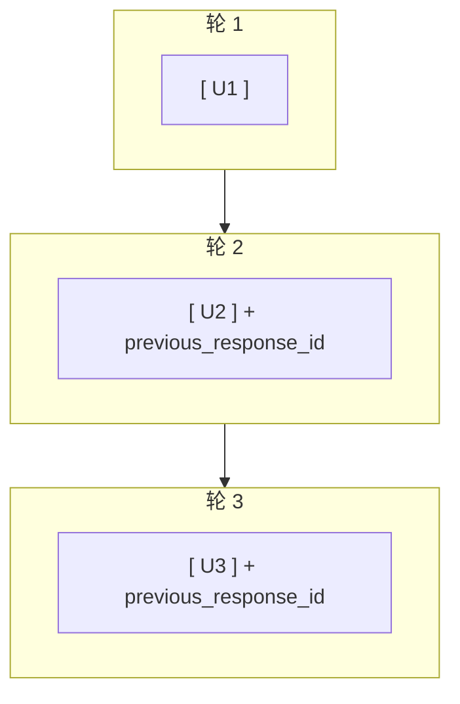
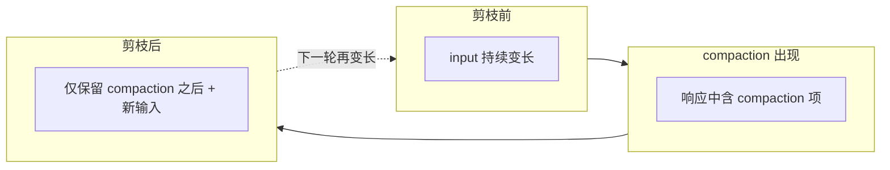
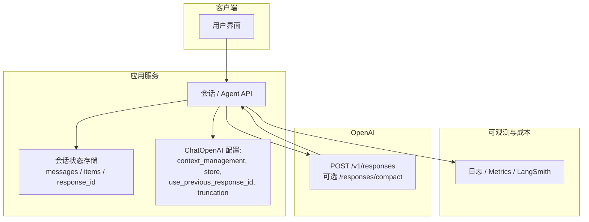

# OpenAI 服务端上下文压缩与 LangChain：详尽概念、边界与使用指南

> **文档目标**：让读者在读完本文后，能回答：Compaction **是什么 / 不是什么**、**和 LangChain 摘要/剪枝有何本质区别**、**三种会话串联模式下请求体积如何演化**、**如何选型与控费**、**落地时容易踩的坑**。  
> **官方与参考链接**（请在生产环境以最新版为准）：  
> - [Compaction / Context management（OpenAI）](https://developers.openai.com/api/docs/guides/compaction)  
> - [Compact API 参考](https://developers.openai.com/docs/api-reference/responses/compact)  
> - [LangChain SummarizationMiddleware](https://reference.langchain.com/python/langchain/agents/middleware/summarization/SummarizationMiddleware/)  
> - [Deep Agents：自主上下文压缩](https://blog.langchain.com/autonomous-context-compression/)  
> - [Deep Agents：上下文管理](https://blog.langchain.com/context-management-for-deepagents/)  
> - LangChain PR：[OpenAI 自动 compaction #35212](https://github.com/langchain-ai/langchain/pull/35212)

---

## 目录

1. [术语与一句话定义](#1-术语与一句话定义)  
2. [背景：为什么需要「压缩」上下文](#2-背景为什么需要压缩上下文)  
3. [OpenAI Server-Side Compaction 详解](#3-openai-server-side-compaction-详解)  
4. [OpenAI 的两种用法：自动内嵌 vs 独立 Compact 端点](#4-openai-的两种用法自动内嵌-vs-独立-compact-端点)  
5. [会话状态如何串联（官方两种模式）](#5-会话状态如何串联官方两种模式)  
6. [计费、Token 与成本心智模型](#6-计费token-与成本心智模型)  
7. [LangChain 集成：ChatOpenAI 与相关字段](#7-langchain-集成chatopenai-与相关字段)  
8. [LangChain 是否会「自动剪枝」：源码级结论](#8-langchain-是否会自动剪枝源码级结论)  
9. [三种工程模式：累积 messages / previous_response_id / 自研 compaction 剪枝](#9-三种工程模式累积-messages--previous_response_id--自研-compaction-剪枝)  
10. [与 LangChain SummarizationMiddleware 的深度对比](#10-与-langchain-summarizationmiddleware-的深度对比)  
11. [与 Deep Agents 上下文管理（落盘 + 自主压缩工具）的对比](#11-与-deep-agents-上下文管理落盘--自主压缩工具的对比)  
12. [最佳实践与推荐架构](#12-最佳实践与推荐架构)  
13. [反模式、排错清单与 FAQ](#13-反模式排错清单与-faq)  
14. [附录：对话中涉及的 LangChain 版本变更摘要](#14-附录对话中涉及的-langchain-版本变更摘要)  
15. [附录：检查清单（评审用）](#15-附录检查清单评审用)  
16. [最佳实践代码：OpenAI 路线 vs 非 OpenAI 路线](#16-最佳实践代码openai-路线-vs-非-openai-路线)

---

## 1. 术语与一句话定义

| 术语 | 解释 |
|------|------|
| **Responses API** | OpenAI 面向「多轮 + 工具 + 富结构输出」的一类 API 形态；compaction 与之配合使用（见官方 Compaction 文档）。 |
| **Compaction（压缩）** | 在上下文过长时，由服务端生成 **不透明** 的 **compaction 输出项**，用更少 token 延续后续推理所需状态。 |
| **`compact_threshold`** | 与 `context_management` 一起配置；当 **渲染后的 token 规模**超过该阈值时，服务端触发 compaction（官方描述）。 |
| **Opaque（不透明）** | 人类不应把 compaction 项当「摘要正文」阅读；它是 **给下一轮请求接续用的内部表示**（官方明确说明）。 |
| **Client-side summarization** | 在你自己的服务里再调一次（或多次）模型，把旧对话 **写成可读摘要**；与 compaction **机制不同**。 |

**一句话定义**：  
**OpenAI 服务端上下文压缩**是在 **Responses** 请求生命周期内，由 **OpenAI 服务端**在超过阈值时执行的 **状态压缩**，产出 **opaque compaction 项**，用于 **后续轮次在更短输入下保持连贯**——**不是**产品上的「会议纪要」或合规用的明文归档摘要。

**底线（边界）**：

- 不要向终端用户展示 compaction 内容为「AI 生成的对话摘要」。  
- 不要假设 compaction 可替代你们内部的 **审计日志** 或 **合规留痕**（除非法务已认可该形态）。  
- 不要把它与 **`SummarizationMiddleware` 生成的自然语言**混为一谈——后者可读、可改 prompt、可存档。

---

## 2. 背景：为什么需要「压缩」上下文

### 2.1 长会话带来的三类压力

1. **费用**：多数模型按 **输入 token + 输出 token** 计费；每轮都把「从第一轮开始的全部历史」发上去，**单轮输入线性增长**，总成本随轮次 **超线性** 恶化。  
2. **延迟**：请求体更大 → 序列化、网络、服务端处理 **长尾延迟** 往往上升。  
3. **质量（context rot）**：极长上下文中，模型对早期细节「注意力」下降，错误与幻觉风险上升（业界常称 context rot；可与 Chroma 等研究对照，本文不展开）。

### 2.2 常见缓解手段（与 compaction 并列，便于定位）

| 手段 | 谁执行 | 特点 |
|------|--------|------|
| **手动截断** | 应用 | 简单；易丢关键信息。 |
| **滑动窗口** | 应用 | 只保留最近 K 条；可能断工具调用链。 |
| **客户端 LLM 摘要** | 应用 + 模型 | 可控、可读；多一次（或多次）调用与 prompt 维护。 |
| **OpenAI compaction** | OpenAI | 与 Responses 深度集成；opaque；后续输入可显著变短。 |
| **工具结果落盘 / 外置存储** | 应用（如 Deep Agents） | 解决「单条 tool 消息极胖」的问题，与「对话历史压缩」互补。 |

Compaction 解决的是 **「在 OpenAI 生态内、尽量少自己写摘要逻辑」** 的那条路；**不自动解决**「工具返回 2 万 token 仍塞进同一条 message」这类问题——除非配合 **payload 设计 / 落盘 / 裁剪工具输出**。

---

## 3. OpenAI Server-Side Compaction 详解

### 3.1 官方描述的机制（归纳）

依据 [Compaction 文档](https://developers.openai.com/api/docs/guides/compaction)：

- 在 `responses.create`（或 SDK 等价调用）中设置 `context_management`，其中包含 **`type: compaction`** 与 **`compact_threshold`**。  
- 当 **渲染后的 token 数**超过 `compact_threshold`，服务端执行 **server-side compaction**。  
- **同一响应流**中会出现 compaction 相关输出；**不要求**你再单独调用 `/responses/compact`（自动模式）。  
- 返回的 compaction 项 **携带关键先验状态与推理脉络**，以 **更少 token** 进入下一轮；且为 **opaque**，**不拟人读**。  
- 文档提到响应流中可包含 **encrypted compaction item**；若关注 **ZDR（零数据保留）**，可在 Responses 请求上使用 **`store=false`**，文档称该组合下服务端 compaction 仍可 **ZDR-friendly**（以你签约与 OpenAI 最新合规说明为准）。

### 3.2 「自动」到底自动在哪里

- **自动**：相对「你每次自己调 `/responses/compact`」而言——阈值触发、同流输出，由平台完成。  
- **不自动**：**不自动**替你决定业务上「何时该忘记用户隐私」或「何时该归档」——这些仍是产品/合规问题。

### 3.3 与「模型中间截断」的区别

OpenAI 文档中的 **compaction** 与 Responses 上另一参数 **truncation**（例如 `truncation="auto"` 时「可能从中间丢 input 项以塞进窗口」）**不是同一件事**。后者是 **另一套截断策略**；不要在文档层面混用概念（LangChain 里 `ChatOpenAI` 也单独暴露了 `truncation` 字段，见第 7 节）。

---

## 4. OpenAI 的两种用法：自动内嵌 vs 独立 Compact 端点

### 4.1 模式一：随 `responses.create` 自动 compaction（推荐先理解的主路径）

**配置要点**：

```text
context_management = [
  { "type": "compaction", "compact_threshold": <整数阈值> }
]
```

**字段中文说明（逐项）**：

| 字段 | 含义 |
|------|------|
| `context_management` | Responses 的「上下文管理」参数；值为 **字典列表**，可扩展多种策略；当前只关心 compaction。 |
| `type: "compaction"` | 声明本项策略为 **服务端压缩**；若拼写或取值与 API 不一致会直接 400 或静默不生效（以 SDK 为准）。 |
| `compact_threshold` | **正整数**：当前请求里 **渲染后的 token 规模**超过该值时触发 compaction；过小 → 易频繁触发、固定开销高；过大 → 长期 input 偏大。具体最小值与单位以官方最新文档为准。 |

**行为要点**（文档级）：

- 超过阈值 → 服务端 compaction → 流式响应中带 compaction 输出项 → 继续完成当次推理。  
- **后续轮次**必须把状态 **按文档串联**：要么维护 **input 项数组** 并 append 输出（含 compaction），要么使用 **`previous_response_id`** 链式。

**文档示例逻辑（Python 伪结构）**：

```python
# ---------------------------------------------------------------------------
# 模式：OpenAI 官方「无状态 input 数组」链式 + 自动服务端 compaction
# 含义：每一轮请求体里的 input 由你方维护；服务端不会在 HTTP 外替你存整段历史
# ---------------------------------------------------------------------------

# 初始：至少放入第一条用户消息（Responses 的 input 是「项」的列表，不是 Chat Completions 的 messages 简写）
# 注意：真实集成里 content 结构需符合当前 API（纯字符串 vs 多模态块等）
conversation = [{"type": "message", "role": "user", "content": "..."}]

while keep_going:
    # responses.create：走 Responses API；与 chat.completions 不是同一路径
    response = client.responses.create(
        model="...",  # 占位：须换成本账号可用且支持 compaction 的模型 id
        input=conversation,  # 本轮完整输入窗口 = 截至目前累积的所有 input 项
        store=False,  # store=False：降低平台侧持久化；ZDR/合规场景常显式关闭，以法务与最新条款为准
        # context_management：启用「超过阈值则在本响应流内触发 compaction」
        # compact_threshold：渲染后的 token 规模超过该值时服务端执行 compaction（具体语义以官方文档为准）
        context_management=[{"type": "compaction", "compact_threshold": 200000}],
    )

    # 关键一步：把「本轮模型侧输出」全部接到 conversation 末尾
    # output 里除 assistant 文本外，还可能含 function_call、reasoning、compaction 等项
    # compaction 项是 opaque，用于下一轮延续状态，不要当人类摘要读
    conversation.extend(response.output)

    # 再追加用户下一轮输入（同样必须是合法 Responses input 项）
    conversation.append({"type": "message", "role": "user", "content": get_next_user_input()})

    # 【可选优化，见第 5.1 节 Latency Tip】在 extend 之后可裁剪「最后一个 compaction 项之前」的旧项
    # 以减小下一请求的 JSON 体积与延迟；裁剪错误会导致上下文断裂，务必单测覆盖工具链
```

（变量名与模型名以官方示例为准。）

### 4.2 模式二：独立 `POST /v1/responses/compact`

**适用场景**（工程直觉）：

- 你希望 **显式一步**：「现在这一窗太长了，先 compact，再进入下一阶段」。  
- 批处理、流水线、或要在 **两次业务调用之间**固定插入压缩。  
- 需要 **完全 stateless** 的 compact 流程（文档称 standalone 端点 **fully stateless and ZDR-friendly**）。

**关键约束**（文档强调）：

- 你把 **当前完整上下文窗口**（messages、tools、其它 items）发给 compact。  
- 返回的是 **规范化的下一窗**；文档要求：**不要 prune compact 的输出**，应 **整包**作为下一次 `responses.create` 的 input。

**伪代码结构**：

```python
# ---------------------------------------------------------------------------
# 模式：独立 POST /v1/responses/compact（显式压缩一步），再进入下一轮对话
# 与「在 create 里带 context_management 自动压」是两条不同的产品级策略
# ---------------------------------------------------------------------------

# long_input_items_array：当前已经「很胖」的完整窗口（含 user/assistant/tool 等合法项）
# 注意：送入 compact 的窗口仍须落在模型上下文上限之内，否则先报错而非静默成功
compacted = client.responses.compact(
    model="...",  # 占位：与后续 create 使用的模型策略需与官方说明一致
    input=long_input_items_array,
)

# 官方约束：compacted.output 是「规范化的下一窗」，不要手工删掉其中一部分再拼
# 擅自 prune 可能导致下一轮推理缺状态或工具引用断裂
next_input = [
    *compacted.output,  # 整包展开：作为下一轮 responses.create 的 input 基底
    {
        "type": "message",
        "role": "user",
        "content": new_user_text,  # 仅在压缩完成后再追加「本轮新用户话」
    },
]

# 下一轮正常对话；store 仍按合规策略设置
next_response = client.responses.create(
    model="...",
    input=next_input,
    store=False,
)

# compact 响应里的 usage 通常包含 compaction pass 的 token 统计，应计入成本（见第 6 节）
```

### 4.3 两种模式如何并存于同一产品

- **同一条用户会话**通常选定 **一种主策略**：要么 **自动 compaction + 固定串联规则**，要么 **定期显式 compact**，避免团队内多人理解不一致。  
- **可以**在不同 **业务线** 用不同模式（例如客服用链式 id，批处理用 standalone）。

---

## 5. 会话状态如何串联（官方两种模式）

这是使用 compaction 时 **最容易出错** 的部分；错误串联会导致 **上下文断裂、重复计费、或 silent 质量下降**。

### 5.1 模式 α：无状态 Input 数组链式（Stateless input-array chaining）

**做法**：

1. 维护一个 `conversation`（或 `input`）列表。  
2. 每轮调用后执行 `conversation.extend(response.output)`。  
3. 再 append 新的 user message（或其它合法 input 项）。

**OpenAI 文档中的 Latency Tip（性能优化，可选）**：

- 在 append 输出之后，你可以 **丢弃「最近一次 compaction 项之前」的旧条目**，以 **减小下一请求体积**、降低 **长尾延迟**。  
- 文档理由：**最新的 compaction 项已携带继续对话所需上下文**。

**边界**：

- 这是 **客户端（或你的 BFF）** 对数组的裁剪策略；**做错会丢状态**。  
- 必须与 **工具调用、function_call、reasoning** 等 item 的 **依赖关系**一致；生产上建议 **有单测或契约测试**。

### 5.2 模式 β：`previous_response_id` 链式

**做法**：

- 每轮 largely **只发送新的 user message**（或文档允许的增量），并带上 **`previous_response_id`** 指向上一次响应。

**OpenAI 文档约束**：

- 在此模式下 **不要手动 prune**（与模式 α 的「可裁剪」形成 **成对对比**）。  
- 由 **服务端**通过 id 维护会话连续性。

**工程直觉**：

- **单轮 HTTP payload 小**；状态主要在 **OpenAI 侧**（与你的 `store`、合规策略相关）。  
- 你必须 **可靠存储** `response.id` 与业务 `thread_id` 的映射，并处理 **重试、并发、失败回滚**。

### 5.3 对比小结（必读）

| 项目 | Input 数组链式 | previous_response_id |
|------|----------------|------------------------|
| 每轮 payload 典型形态 | 可能很长（若不剪枝） | 通常很短 |
| 是否可裁掉 compaction 前旧项 | **可以**（文档 latency tip） | **不要**（文档明确） |
| 状态主要存放位置 | 你的进程 / DB 里的数组 | OpenAI 侧 + 你的 id 映射 |
| 离线审计难度 | 你手里有全量 items（若你存了） | 依赖平台能力与你的日志策略 |

### 5.4 补充伪代码：`previous_response_id` 链式（与模式 α 对照）

```python
# ---------------------------------------------------------------------------
# 模式 β：previous_response_id 链式（OpenAI 文档：不要手动 prune）
# 含义：每轮 HTTP 请求体里 largely 只带「新用户话」，前文由服务端用 id 接续
# ---------------------------------------------------------------------------

previous_id = None  # 第一轮没有上一响应，故为 None

while keep_going:
    user_item = {"type": "message", "role": "user", "content": get_next_user_input()}

    if previous_id is None:
        # 首轮：没有可链的响应，只能把首条 user 放进 input（或官方允许的初始项）
        response = client.responses.create(
            model="...",
            input=[user_item],
            store=False,
            context_management=[{"type": "compaction", "compact_threshold": 200000}],
        )
    else:
        # 后续轮：带上 previous_response_id，input 通常仅为本轮新增（常见为单条 user）
        # 不要再把整段历史拼进 input，否则失去链式意义且可能违反文档约定
        response = client.responses.create(
            model="...",
            previous_response_id=previous_id,
            input=[user_item],
            store=False,
            context_management=[{"type": "compaction", "compact_threshold": 200000}],
        )

    # 从响应取出 id，供下一轮链式；须持久化到你的 DB 并与业务 thread_id 绑定（重试时要幂等）
    previous_id = response.id

    # 业务层若要在 UI 展示全文，可自行维护「影子副本」；但发给 API 的仍应按链式规则
```

---

## 6. 计费、Token 与成本心智模型

### 6.1 通用计费公式（直觉）

对单次模型调用，常见形式为：

\\[
\text{Cost} \\approx c\_{in} \\cdot T\_{in} + c\_{out} \\cdot T\_{out}
\\]

其中 \\(c\_{in}, c\_{out}\\) 为模型单价（如 $/1M tokens），\\(T\_{in}, T\_{out}\\) 为本轮输入/输出 token。具体以 [OpenAI Pricing](https://openai.com/api/pricing) 为准。

### 6.2 Compaction 相关：不是「免费」

- [Compact API 参考](https://developers.openai.com/docs/api-reference/responses/compact) 中对响应 `usage` 的说明包含 **「Token accounting for the compaction pass」** 等字段（如 input_tokens、output_tokens、reasoning_tokens 等，以当前 schema 为准）。  
- **含义**：compaction **对应一次（或一段）可计量的 token 消耗**，应计入成本模型，而不是假设为 0。

### 6.3 何时可能「更贵」、何时可能「更省」

**可能更省（长期）**：

- 对话 **轮次多**；压缩成功后，后续多轮 **输入 token 明显下降**，总账随时间摊薄。  
- 你 **配合**文档建议的 payload 管理（模式 α 的剪枝或模式 β 的链式），避免每轮仍发全长历史。

**可能更贵或「不划算」**：

- **短会话**：压缩刚触发对话就结束了，**压缩 pass 的成本摊不回来**。  
- **`compact_threshold` 过低**：**频繁触发** compaction，固定开销累积。  
- **重复策略**：同时 **compaction + 客户端全文摘要**，两边都在「压上下文」，常出现 **双倍成本** 与 **难调试**。

### 6.4 LangChain `SummarizationMiddleware` 的成本形态（对比用）

- 每次触发摘要：**一整次额外的 chat 调用**（输入 = 待摘要的历史片段，输出 = 摘要文本）。  
- **透明**：你可选用 **便宜的小模型** 专门摘要、**贵的大模型** 做任务，成本结构 **完全可控**。  
- 与 compaction **不是替代关系**时：两者叠加要 **单独算账**。

### 6.5 建议的实证方法

1. 固定一批 **真实对话脚本**（含工具调用更佳）。  
2. 开关 compaction / 调整阈值 / 开关摘要中间件，分别跑 A/B。  
3. 记录：**每轮 input_tokens、output_tokens、P50/P95 延迟、美元/千轮**。  
4. 用 **LangSmith** 或自建日志对齐 **同 thread** 的调用序列。

### 6.6 伪代码：用 usage 粗算单轮费用（中文注释）

```python
# ---------------------------------------------------------------------------
# 仅作「把 token 换成钱」的直觉演示；真实账单以 OpenAI 控制台与合约为准
# 不同模型、缓存命中、reasoning_tokens 等都会影响单价，下表单价为占位
# ---------------------------------------------------------------------------

def estimate_round_cost_usd(
    input_tokens: int,
    output_tokens: int,
    price_in_per_million: float,  # 每百万 input token 美元价（占位）
    price_out_per_million: float,  # 每百万 output token 美元价（占位）
) -> float:
    # 按常见分段计价可继续拆 input_tokens_details.cached_tokens 等，此处略
    return (
        (input_tokens / 1_000_000) * price_in_per_million
        + (output_tokens / 1_000_000) * price_out_per_million
    )


# compaction 触发时：同一响应的 usage 可能包含「主生成 + compaction pass」等细分，需按 API 返回字段累加
# 摘要中间件触发时：除主模型一轮外，再单独对「摘要调用」的 usage 调一次本函数后相加

# 对比 A/B 时：对同一线程求 sum(estimate_round_cost_usd(...))，再比较总成本与 P95 延迟
```

---

## 7. LangChain 集成：ChatOpenAI 与相关字段

### 7.1 启用 OpenAI 自动 compaction（社区实现入口）

PR：[feat(openai): support automatic server-side compaction #35212](https://github.com/langchain-ai/langchain/pull/35212)。

```python
# ---------------------------------------------------------------------------
# LangChain：通过 ChatOpenAI 把 OpenAI 的 context_management 传给底层 Responses 调用
# 前提：langchain-openai 版本需支持该参数；context_management 非空时通常会走 Responses API
# ---------------------------------------------------------------------------

from langchain_openai import ChatOpenAI

model = ChatOpenAI(
    # 模型名：必须换成你账号可用、且当前平台支持 compaction 的 id（文档会列可用模型）
    model="gpt-5.2",
    # 透传到 OpenAI：启用服务端 compaction；compact_threshold 越小越容易频繁触发压缩 pass
    # 调参建议：结合 usage、P95 延迟、总费用做 A/B，勿照搬文档示例里的数字
    context_management=[{"type": "compaction", "compact_threshold": 10_000}],
    # 常见可选组合（按业务再开）：
    # use_previous_response_id=True  → 对应官方模式 β，避免每轮发送全长 messages（见第 7.2 / 9.2 节）
    # store=False                    → 合规向显式关闭存储时考虑
    # use_responses_api=True         → 若版本推断有误可强制走 Responses（以当前库文档为准）
)

# 调用侧仍须注意：若不用 previous_response_id，而是不断 append 全量 messages，则属模式 A，payload 仍会膨胀
```

**说明**：

- **`context_management` 非空** 时，在 `langchain_openai` 的实现逻辑中会 **倾向走 Responses API**（与 `use_responses_api` 的推断条件相关；以你安装的版本源码为准）。  
- **模型名、SDK 最低版本、是否支持 compaction**，必须以 **OpenAI 与 langchain-openai 当前文档** 为准；本文不锁定版本号。

### 7.2 `use_previous_response_id`（对应官方模式 β）

`ChatOpenAI` 字段含义（上游文档字符串摘要）：

- 为 `True` 时，使用 **最近一次响应的 id** 作为 `previous_response_id`。  
- **「最近一次 response 之前的输入消息会从请求 payload 中丢弃」**——即 **每轮只带尾部消息 + 链式 id**。  
- 等价写法示例：也可在 `invoke(..., previous_response_id="resp_xxx")` 手动传入。

**与 compaction 的关系**：

- 这是 **payload 形状**层面的优化，**不是**「按 compaction 项剪枝」的实现。  
- 但若你的目标是 **避免模式 A 的无限膨胀**，**模式 B 往往是 LangChain 侧最省心的主路径**。

### 7.3 `store`（存储与合规）

- Responses API 下默认值与 Chat Completions 不同；`ChatOpenAI` 暴露 `store: bool | None`。  
- 若你处于 **ZDR / 数据最小化** 场景，请 **显式**阅读 OpenAI 当前条款并配置 `store`；compaction 文档对 `store=false` 有专门叙述。

### 7.4 `truncation`（勿与 compaction 混淆）

- `truncation` 为 **`'auto'`** 时：Responses 可能 **从序列中间丢弃 input 项** 以适配窗口。  
- 这是 **平台截断策略**，与 **compaction 产出 compaction 项** 不同；调试问题时要 **分开记录** 二者是否同时开启。

### 7.5 Responses 输出中的 `compaction` 在 LangChain 里长什么样（实现细节）

在 `langchain_openai` 的 `base.py` 中，`compaction` 与 `reasoning`、`function_call` 等一样，作为 **Responses 输出 item 类型** 被 **解析进 `AIMessage` 的 content blocks**（或流式 chunk）。在向 Responses 回传时，这些 block 类型也会被 **映射回 input 项**（与官方「append output」一致）。

**读者应带走的事实**：

- LangChain **会保留** compaction 块在消息结构里，以便 **下一轮** 构造 payload 时带回给 API。  
- LangChain **不会**在此基础上 **自动**执行「丢弃最后一个 compaction 之前的所有 items」这种 **模式 α 的可选优化**——见第 8 节。

### 7.6 `init_chat_model` 与多供应商

若使用 `init_chat_model("openai:...", ...)`，需确认 **对应参数是否透传** `context_management` / `use_previous_response_id`（随 LangChain 版本变化）。**原则**：以 **实际调用 `ChatOpenAI` 的构造参数** 为准做验证。

---

## 8. LangChain 是否会「自动剪枝」：源码级结论

### 8.1 问题重述

用户常问：「我开了 `context_management` compaction，LangChain 会不会像 OpenAI 文档说的那样，自动丢掉 compaction 之前的旧消息？」

### 8.2 结论（针对当前社区主线的描述）

| 问题 | 结论 |
|------|------|
| 是否 **自动按 compaction 边界** 删除旧 input？ | **否**。未在通用 `ChatOpenAI` 路径实现该策略。 |
| 是否 **解析并回传** compaction 块？ | **是**。与 Responses 互操作需要保留该类型。 |
| `use_previous_response_id=True` 是否会减小 payload？ | **是**。丢弃「最近一次带 id 的响应之前」的消息，仅保留尾部 + id。 |
| `truncation="auto"` 是否会减小 payload？ | **可能**，但是 **另一套语义**（中间丢项），**不等价**于 compaction 剪枝。 |

### 8.3 工程推论

- **模式 A**（纯累积 `messages`）：只要你不断 append，**LangChain 默认会把越来越长的列表交给 `_construct_responses_api_payload`** → **请求侧体积持续增长**，除非你自己裁剪或使用模式 B/C。  
- **模式 B**：交给 LangChain + OpenAI **链式 id** 管理。  
- **模式 C**：你在 **组装 input 列表的应用层** 实现「找最后一个 compaction → 切片」——**可放在 LangChain 调用之外**，也可封装为你们内部的 `trim_conversation_for_responses(items)`。

---

## 9. 三种工程模式：累积 messages / previous_response_id / 自研 compaction 剪枝

本节把「体积如何涨」与 **伪代码** 写清楚，便于实现与评审。

### 9.1 模式 A：普通 `invoke` + 累积 `messages` + `context_management`

**特征**：`messages: list[BaseMessage]` 每轮 append；调用 `model.invoke(messages)`。

**伪代码**：

```python
# ---------------------------------------------------------------------------
# 模式 A：LangChain 里「普通 invoke + 列表里累积全部 HumanMessage / AIMessage」
# 风险：LangChain 不会按 compaction 自动删掉旧消息；每轮构造 payload 时列表越来越长
# compaction 仍可能在 OpenAI 当次响应内发生，但「你发给 API 的 messages」未必因此变短
# ---------------------------------------------------------------------------

# messages：标准 LC 消息列表；首轮只有用户
messages = [HumanMessage("...")]

while True:
    # invoke：内部会把当前整个 messages 转成 Responses input（或等价结构）发给 OpenAI
    # 若 model 已设 context_management，则超过阈值时服务端可能在当次流里产出 compaction 块
    ai = model.invoke(messages)

    # 把助手整条回复追加进内存列表（含 tool_calls、多模态块、以及可能的 compaction 等附加结构）
    messages.append(ai)

    # 再追加下一轮用户输入 → 下一轮 invoke 时 messages 长度 +2，线性增长
    messages.append(HumanMessage(next_user()))

    # 若不在此处自行裁剪、不改用 use_previous_response_id、也不做模式 C 的 items 剪枝，
    # 则请求体积随轮次持续上升（见第 8 节源码级结论）
```

**体积**：第 \\(n\\) 轮 roughly **O(n)** 条消息；若含长 tool 结果，**O(n) × 单条长度** 可能极陡。

**compaction 的角色**：OpenAI 可能在 **当次响应** 内做服务端压缩，**但若你下一轮仍发送完整 `messages`**，**客户端→服务端** 的数组仍可能 **非常长**——这是前文强调的 **底线**。



### 9.2 模式 B：`use_previous_response_id=True`

**特征**：`ChatOpenAI` 从 **最后一条带 `response_metadata["id"]` 的 AIMessage** 推断 id，并把 **其之前的消息移出 payload**。

**伪代码（概念）**：

```python
# ---------------------------------------------------------------------------
# 模式 B：LangChain ChatOpenAI 封装了 official「previous_response_id」链式
# 效果：请求体里丢弃「最近一次带 response id 的 AIMessage 之前」的旧消息，只带尾部 + id
# 注意：这与「按 compaction 项剪枝」不是同一规则；详见第 8 节对照表
# ---------------------------------------------------------------------------

model = ChatOpenAI(
    ...,
    use_previous_response_id=True,  # 关键：启用后 _get_request_payload 会切片 messages 并填 previous_response_id
    context_management=[{"type": "compaction", "compact_threshold": ...}],  # 可与链式同时开
)

# 第一轮：只有用户，尚无「上一响应 id」
messages = [HumanMessage("u1")]
ai1 = model.invoke(messages)
# ai1.response_metadata 中应带有 OpenAI 返回的 response id（具体键名以 LC 版本为准），供下一轮链式使用

# 模拟真实会话：状态里仍保存完整 messages（例如给 LangGraph checkpointer、或给 UI 全量展示）
messages.extend([ai1, HumanMessage("u2")])

# 第二轮 invoke：库内部实际发往 OpenAI 的 payload 通常仅为「新用户 u2 + previous_response_id」
# 而不是把 [u1, a1, u2] 全长再发一遍 → 单轮 HTTP 体积近似常数
ai2 = model.invoke(messages)

# 边界：若 AIMessage 丢失 id、或中间插入无 id 的 assistant 占位，链式可能回退或报错，需集成测试覆盖
```

**体积**：单轮 payload **近似常数级**（仅新输入 + 链式元数据）；完整历史若在 LangGraph state 里仍可能 **全量增长**——那是 **另一层存储**，与 **HTTP payload** 分离。



### 9.3 模式 C：自研「extend(output) + 按最后 compaction 剪枝」

**特征**：你维护的是 **OpenAI Responses 的 input item 列表**（dict 列表），而不是仅 `HumanMessage`/`AIMessage`；或你在序列化层等价实现。

**伪代码（逻辑级）**：

```python
# ---------------------------------------------------------------------------
# 模式 C：原生维护 Responses「input 项数组」+ 官方 Latency Tip（按最后 compaction 裁剪）
# 适用：你不走 previous_response_id，又不想无限制累积整窗；愿意自己承担剪枝正确性责任
# 警告：错误裁剪会破坏 function_call 与 tool 输出、reasoning 等依赖顺序，必须按业务写单测
# ---------------------------------------------------------------------------

# conversation：与官方文档一致，元素为 dict，type 可为 message / function_call / compaction 等
conversation: list[dict] = [...]


def trim_after_last_compaction(items: list[dict]) -> list[dict]:
    """
    仅保留「最后一个 type==compaction 的项」及其之后的所有项。
    文档依据：最新 compaction 项已携带继续对话所需状态，删掉其前旧项可降延迟与请求体积。

    注意：
    - 若本轮响应里根本没有 compaction（未过阈值），last_i 为 None，此时应原样返回 items，
      否则会把整段历史误删成空。
    - 生产代码往往还要处理「嵌套结构 / 不同 SDK 对 type 字段的命名」，此处为最小演示。
    - 若存在多个 compaction，保留「最后一次」对应索引，与官方 latency tip 一致。
    """
    last_i = None
    for i, it in enumerate(items):
        if it.get("type") == "compaction":
            last_i = i
    # 从未触发过 compaction：不得清空历史
    if last_i is None:
        return items
    return items[last_i:]


while True:
    resp = client.responses.create(
        model=model,  # 占位
        input=conversation,
        context_management=[{"type": "compaction", "compact_threshold": N}],
        store=False,
    )

    # 与模式一相同：先把本轮所有输出项接到数组末尾（含可能出现的 compaction）
    conversation.extend(resp.output)

    # 【可选但推荐在长跑中评估】执行 Latency Tip：扔掉最后一个 compaction 之前的旧项
    # 若你本轮刚产生 compaction，此处会显著缩短 conversation；若未产生，函数返回原列表
    conversation = trim_after_last_compaction(conversation)

    # 再追加用户下一轮输入
    conversation.append({"type": "message", "role": "user", "content": next_user()})

    # 与模式 β 不可混用同一套剪枝规则：previous_response_id 模式下官方要求不要手动 prune
```

**体积**：**锯齿形**——剪枝后骤降，随后随轮次再升，直至下一次 compaction。



### 9.4 三模式体积曲线（示意）

```mermaid
xychart-beta
    title "单轮请求上下文相对体积（示意，非实测数据）"
    x-axis [轮1, 轮2, 轮3, 轮4, 轮5, 轮6, 轮7, 轮8]
    y-axis "相对体积" 0 --> 100
    line "A 累积 messages" [8, 18, 28, 38, 48, 58, 68, 78]
    line "B previous_response_id" [10, 12, 11, 12, 11, 12, 11, 12]
    line "C 自研 compaction 剪枝" [8, 18, 28, 35, 15, 25, 35, 18]
```

---

## 10. 与 LangChain SummarizationMiddleware 的深度对比

### 10.1 它做什么（官方参考摘要）

[`SummarizationMiddleware`](https://reference.langchain.com/python/langchain/agents/middleware/summarization/SummarizationMiddleware/)：

- 在 **接近 token 上限**（或消息条数、或窗口比例）时，把 **较早的对话** 交给 **另一个 LLM** 生成 **摘要**。  
- **保留最近**若干消息；并注意 **AI / Tool 消息成对** 等连续性约束（文档描述）。  
- 钩子运行在 agent 的 **`before_model`**（及异步等价）路径。

### 10.2 构造函数参数（便于落地与评审）

| 参数 | 作用 |
|------|------|
| `model` | **必填**；用于生成摘要的 `str | BaseChatModel`。 |
| `trigger` | 触发条件：`("tokens", 3000)`、`("messages", 50)`、`("fraction", 0.8)` 等，可 **列表表示任一满足即触发**。 |
| `keep` | 摘要后保留多少上下文：`("messages", 20)`、`("tokens", 3000)`、`("fraction", 0.3)` 等。 |
| `token_counter` | 计 token 的函数，默认近似计数。 |
| `summary_prompt` | 摘要 prompt 模板。 |
| `trim_tokens_to_summarize` | 送入摘要模型的最大 token；`None` 表示不裁。 |

### 10.3 与 OpenAI compaction 的「本质差异表」

| 维度 | OpenAI compaction | SummarizationMiddleware |
|------|-------------------|-------------------------|
| 执行者 | OpenAI 服务端 | 你的进程 |
| 产物 | **Opaque** compaction 项 | **自然语言**摘要消息 |
| 可调试性 | 弱（读不了内容） | 强（可看摘要、改 prompt） |
| 计费形态 | compaction pass + 主响应（以 usage 为准） | **显式多一次**摘要调用 |
| 供应商 | 绑定 OpenAI Responses 能力 | 摘要模型 **任选** |
| 与工具胖消息 | **不专门解决**单条 tool 巨大 | **不自动解决**；需配合工具输出策略 |
| 合规展示 | **不适合**作为用户可见说明 | 可设计为「对话小结」（需产品审核） |

### 10.4 组合使用建议

- **默认**：二选一为主策略。  
- **若必须组合**：明确分工（例如：compaction 管 OpenAI 侧状态；摘要仅用于 **用户可见侧栏** 且 **不同步回写** 模型上下文），并 **做 A/B 费用测试**。

### 10.5 伪代码：`SummarizationMiddleware` 如何挂在 agent 上（中文注释完整版）

```python
# ---------------------------------------------------------------------------
# LangChain Agent：用「客户端 LLM 摘要」压缩历史，与 OpenAI compaction 机制不同
# 触发时：会多一次（或按实现多次）对「摘要模型」的调用 → 费用结构透明、可换小模型
# 注意：create_agent、middleware 的 import 路径随 langchain 主版本而变，以下为概念示例，集成前请以你锁定的版本文档为准
# ---------------------------------------------------------------------------

from langchain.agents import create_agent  # 示例路径；若 ImportError 请查当前版 package 结构
from langchain.agents.middleware import SummarizationMiddleware
from langchain_openai import ChatOpenAI

# 主任务模型：负责工具调用与最终回答（通常选强模型）
main_model = ChatOpenAI(model="gpt-4.1")

# 摘要专用模型：可选用更便宜、上下文够用的模型，降低每次压缩的边际成本
summary_model = ChatOpenAI(model="gpt-4.1-mini")

agent = create_agent(
    model=main_model,
    tools=[...],  # 占位：你的工具列表
    middleware=[
        SummarizationMiddleware(
            model=summary_model,  # 必填：生成「可读摘要」时实际调用的模型
            # trigger：满足任一条件即触发摘要（列表 = OR 语义）
            trigger=[
                ("fraction", 0.85),  # 用量达到模型最大输入的 85% 时触发（近似计数）
                ("messages", 80),    # 或消息条数达到 80 时触发
            ],
            # keep：摘要完成后，保留「最近」多少上下文（下面保留最近 20 条消息）
            keep=("messages", 20),
            # trim_tokens_to_summarize：送给摘要模型的「待摘要片段」最多多少 token，防止摘要调用本身爆窗
            # 传 None 表示不裁（慎用，长历史时摘要调用可能极贵或失败）
            trim_tokens_to_summarize=8000,
            # summary_prompt：可改为你们业务定制的摘要指令（默认模板见官方参考）
            # token_counter：可换为精确 tokenizer，默认多为近似计数
        ),
    ],
)

# 运行时：middleware 在 before_model（及异步路径）里拦截，先可能改写 state 中的 messages
# 与 ChatOpenAI(context_management=...) 同时开启时：两边都可能动上下文 → 务必做费用与行为 A/B

# 边界：SummarizationMiddleware 不解决「单条 tool 消息 2 万 token」问题；需工具层截断或落盘
```

---

## 11. 与 Deep Agents 上下文管理（落盘 + 自主压缩工具）的对比

### 11.1 Deep Agents 动机（博文归纳）

[Autonomous context compression](https://blog.langchain.com/autonomous-context-compression/) 指出：

- 固定阈值（例如接近上下文 85% 才压）可能在 **糟糕时机** 触发（如复杂重构中途）。  
- 人类常用「/compact」在 **任务边界** 手动压缩；Deep Agents 则提供 **工具**，让模型在 **更合适时机** 主动触发压缩。

### 11.2 上下文管理的多手段（与 compaction 互补）

[Context management for Deep Agents](https://blog.langchain.com/context-management-for-deepagents/) 描述的多类技术包括（博文级归纳）：

- **大工具结果落盘**（例如超过某 token 阈值写入虚拟文件系统，窗口内只保留引用路径）。  
- **大工具输入**在高压下截断或外置。  
- **摘要**当 offloading 仍不足时，由 LLM 生成结构化摘要；**完整历史**可仍在文件系统中保留以便恢复。

### 11.3 与 OpenAI compaction 的边界

- Deep Agents 解决的是 **Agent harness 级别** 的「工作记忆管理」——尤其 **工具 I/O 体积**。  
- OpenAI compaction 解决的是 **OpenAI Responses 上下文管线** 内的 **服务端状态压缩**。  
- **编码类长任务**：往往 **两者思路都可出现**；需 **分层设计**，避免重复压缩。

### 11.4 SDK 启用自主压缩工具（示例来自博文）

```python
# ---------------------------------------------------------------------------
# Deep Agents：在 harness 层增加「模型可主动调用」的压缩工具（自主 compact）
# 与 OpenAI compaction 的关系：解决「何时压」的策略不同；可并存于大系统但需避免重复压缩
# 依赖：deepagents 包版本、以及博文/文档中的 API 名称以当前官方为准
# ---------------------------------------------------------------------------

from deepagents import create_deep_agent
from deepagents.backends import StateBackend
from deepagents.middleware.summarization import create_summarization_tool_middleware

# StateBackend：默认后端类型示例；若你用持久化虚拟文件系统需换对应 Backend
backend = StateBackend

# model 字符串：OpenRouter 风格或 deepagents 约定的 "provider:model" 形式；以文档为准
_model_id = "openai:gpt-5.4"

agent = create_deep_agent(
    model=_model_id,
    middleware=[
        # 将「压缩对话上下文」暴露为工具，由策略模型在任务边界等时机调用
        # 参数与内置 summarization 中间件对齐（博文描述）；用于减少固定阈值带来的「糟糕时机压缩」
        create_summarization_tool_middleware(_model_id, backend),
    ],
)

# 运行后：模型可在适当时机调用 compact 类工具；CLI 侧还有用户手动 /compact 的交互（见博文）
# 成本：除 OpenAI compaction pass 外，另计 Deep Agents 侧 LLM 与存储；需整体观测
```

（模型名与 API 以当前 Deep Agents 文档为准。）

---

## 12. 最佳实践与推荐架构

### 12.1 决策流程（文字版）

1. **是否必须用 OpenAI 且已上 Responses？** 否 → compaction 可能不适用或仅部分适用。  
2. **会话长度预期？** 极短 → 可能不必上 compaction。  
3. **payload 策略？** 能改用 `previous_response_id` → 优先评估 **模式 B** 以降低客户端无限膨胀。  
4. **要强控制批量压缩？** 考虑 **standalone compact**。  
5. **工具返回极大？** 加 **落盘/引用** 或 Deep Agents 类策略，**不要**只指望 compaction。  
6. **合规？** 明确 `store`、ZDR、数据驻留，与法务对齐。

### 12.2 分层架构图



### 12.3 监控指标建议

- 每轮 **input_tokens**、**output_tokens**、**总延迟**、**compaction 是否出现**（可从流式 item 类型或日志标记）。  
- **错误率**（400/429/5xx）、**重试次数**。  
- **业务 thread** 维度的 **美元/千轮**。

---

## 13. 反模式、排错清单与 FAQ

### 13.1 反模式

1. **模式 B 下仍手动大量删除消息** → 可能破坏链式前提。  
2. **模式 A 下假设「开了 compaction 就不会涨」** → 客户端仍发全长历史。  
3. **compaction + 全文摘要** 无评估叠加。  
4. **把 compaction 块当用户摘要展示**。  
5. **混淆 `truncation` 与 compaction**，排错时看错开关。

### 13.2 FAQ

**Q：compaction 能否保证不丢信息？**  
A：官方描述为在更少 token 下延续 **关键**状态；不是无损压缩保证。重要业务事实应 **外置存储**（DB、artifact）。

**Q：LangChain 会自动剪枝吗？**  
A：**不会**按 compaction 边界自动剪；`use_previous_response_id` 会按 **response 链**减小 payload。见第 8 节。

**Q：独立 compact 返回能只取一部分吗？**  
A：文档要求 **整包**传递；擅自裁剪高风险。

**Q：摘要中间件能替代 compaction 吗？**  
A：**机制不同**；一个产生 **可读摘要**，一个产生 **opaque 项**。是否「替代」取决于你是否 **绑定 OpenAI** 与 **合规/调试**需求。

### 13.3 排错检查步骤

1. 确认 **实际 HTTP** 走的是 Responses 而非误走 Chat Completions。  
2. 打印 **每轮 payload 消息条数 / 近似 token**。  
3. 对照 **模式 A/B/C** 检查是否与官方剪枝规则冲突。  
4. 看 **usage** 是否出现异常高的 input。  
5. 单测：**带 tool 的多轮** 与 **带 compaction 输出** 的串联。

---

## 14. 附录：对话中涉及的 LangChain 版本变更摘要

> 以下为 **Release 条目级摘要**，便于溯源；**不等价**于完整 changelog。请以 GitHub Release 为准。

### 14.1 [langchain 1.2.11](https://github.com/langchain-ai/langchain/releases/tag/langchain%3D%3D1.2.11)

条目较多，包括但不限于：

- **`langchain-openrouter`** 官方集成包、`ChatOpenRouter`（[#35211](https://github.com/langchain-ai/langchain/pull/35211)）。  
- **OpenAI 自动服务端 compaction**（[#35212](https://github.com/langchain-ai/langchain/pull/35212)）。  
- **PII 中间件**：自定义 detector 在 hash/mask 策略下的 **KeyError** 修复（[#35651](https://github.com/langchain-ai/langchain/pull/35651)）。  
- **Gemini 3** 在带 tools 时 **`ProviderStrategy` / `AutoStrategy`** 行为修复（[#34464](https://github.com/langchain-ai/langchain/pull/34464)）。  
- **`init_chat_model` 报错信息**改进（[#35167](https://github.com/langchain-ai/langchain/pull/35167)）。  
- 大量依赖与 **`langgraph-checkpoint` major** 等工程变更（见 Release 列表）。  
- **Anthropic Bedrock**：曾有 wrapper 与 `init_chat_model` 相关变动，随后有 **revert 并迁往 `langchain-aws`** 的脉络（[#35366](https://github.com/langchain-ai/langchain/pull/35366)、[#35371](https://github.com/langchain-ai/langchain/pull/35371)）；**生产请以 `langchain-aws` 文档与版本为准**。

### 14.2 [langchain 1.2.12](https://github.com/langchain-ai/langchain/releases/tag/langchain%3D%3D1.2.12)

- **`wrap_model_call` / `wrap_tool_call`** 增加 tracing，并对 **`request.runtime`、`handler`** 等做 scrub 以降低 trace 风险（[#35765](https://github.com/langchain-ai/langchain/pull/35765)）。

### 14.3 [langchain 1.2.13](https://github.com/langchain-ai/langchain/releases/tag/langchain%3D%3D1.2.13)

- **LangSmith**：`create_agent` / `init_chat_model` 增加 **`ls_integration`** 元数据（[#35810](https://github.com/langchain-ai/langchain/pull/35810)）。  
- **`langchain.agents.middleware` 导出 `Runtime`**（[#35975](https://github.com/langchain-ai/langchain/pull/35975)）。  
- **OpenAI Responses**：`_construct_responses_api_input` 为 user/system/developer 补 **`type: message`**，修复严格兼容网关（如部分 Azure AI Foundry）400（[#35693](https://github.com/langchain-ai/langchain/pull/35693)）。  
- **`_BUILTIN_PROVIDERS` 增加 baseten** 等（[#35777](https://github.com/langchain-ai/langchain/pull/35777)）。  
- 多项 CI、依赖与 lint 变更（见 Release）。

---

## 15. 附录：检查清单（评审用）

- [ ] 已向下游说明 compaction 产出为 **opaque**，**不**作为用户可见「摘要」？  
- [ ] 已选定 **模式 A / B / C**，并文档化 **payload 增长策略**？  
- [ ] **模式 B** 下未违反「**不手动 prune**」前提？  
- [ ] **模式 C** 的剪枝函数通过 **工具调用链** 单测？  
- [ ] **store / ZDR / 驻留** 已与合规对齐？  
- [ ] **compaction 与摘要/truncation** 的开关组合已做 **费用 A/B**？  
- [ ] **超大 tool 输出** 是否有 **外置/截断** 策略，而非仅依赖 compaction？  
- [ ] **监控** 已覆盖 input_tokens、延迟、错误率与 **compaction 发生频率**？

---

## 16. 最佳实践代码：OpenAI 路线 vs 非 OpenAI 路线

> **文件在仓库中的位置（请按你实际落盘对照）**  
> - **LangChain 单仓**（`langchain` 仓库根目录下）建议与 v1.2.11 文档同级放置：  
>   - 本指南：`libs/langchain_v1/doc/v1.2.11/openai-compaction-langchain-guide.md`  
>   - 完整示例（含分方案文件头注释、优缺点、函数骨架）：`libs/langchain_v1/doc/v1.2.11/examples/context_compression_best_practices.py`  
> - 从本 Markdown **所在目录** 引用示例脚本的**相对链接**（与上述布局一致时有效）：[`./examples/context_compression_best_practices.py`](./examples/context_compression_best_practices.py)  
> - 若你暂时放在**其他项目**（例如仅用于内部分享的 `docs/` 目录），则等价布局为：`docs/openai-compaction-langchain-guide.md` 与 `docs/examples/context_compression_best_practices.py`，相对链接同样为 `./examples/...`。  
>
> 下文为 **方案对照表 + 核心片段**；生产环境请替换模型名、补全错误处理与持久化。

### 16.1 方案总览

| 编号 | 名称 | 是否依赖 OpenAI compaction | 核心手段 | 典型优点 | 典型缺点 |
|------|------|-----------------------------|----------|----------|----------|
| A | Responses + compaction + `previous_response_id` | **是** | 链式 id，小 payload | 实现相对简单、符合官方「勿手动 prune」 | 绑定 OpenAI；id 持久化与重试要设计 |
| B | Responses + compaction + input 数组 + 剪枝 | **是** | `extend(output)` + 裁 compaction 前 | 自控 items、可降延迟 | 剪枝易断工具链；维护成本高 |
| C | LangChain `ChatOpenAI` + compaction + 链式 | **是** | LC 封装 payload | 与 Agent/图集成快 | 升级需回归；语义是 id 剪枝非 compaction 剪枝 |
| D | 滑动窗口 | **否** | 只保留最近 K 条 | 任意模型、零魔法 | 易丢信息；tool 对可能断裂 |
| E | 通用 LLM 摘要 | **否** | 任意 chat 模型写摘要 | 多供应商、可读、可审计（摘要文本） | 多一次调用；摘要质量依赖 prompt |
| F | `SummarizationMiddleware` | **否**（摘要模型可选非 OpenAI） | Agent 中间件自动触发 | 少写调度代码 | 与 compaction 叠加以防重复压缩 |

### 16.2 路线一：使用 OpenAI（含 compaction）——推荐主路径示例

**场景**：长对话、主模型在 OpenAI、希望利用 **服务端 compaction** 且 **单轮请求不要无限变长**。  
**推荐组合**：**compaction + `previous_response_id`**（对应上表 **方案 A**；LangChain 见 **方案 C**）。

```python
# 【方案 A 要点】OpenAI Responses：compaction + previous_response_id
# 优点：payload 小；服务端压缩；不必自写摘要 prompt。
# 缺点：绑定 OpenAI；须持久化 response id；compaction 不可当用户可读摘要。
#
# from openai import OpenAI
# client = OpenAI()
# prev_id = None
# while True:
#     u = input("User: ")
#     kwargs = dict(
#         model="gpt-5.2",
#         input=[{"type": "message", "role": "user", "content": u}],
#         store=False,
#         context_management=[{"type": "compaction", "compact_threshold": 50_000}],
#     )
#     if prev_id:
#         kwargs["previous_response_id"] = prev_id
#     r = client.responses.create(**kwargs)
#     prev_id = r.id
```

**LangChain 等价思路（方案 C）**：`ChatOpenAI(..., use_previous_response_id=True, context_management=[...])`，见示例文件 `langchain_openai_compaction_and_chain()`。

### 16.3 路线二：使用 OpenAI 但要「自控 items + 官方 Latency Tip」

**场景**：必须 **DB 存全量 items**、或要对 **剪枝时机** 做审计。  
**对应**：**方案 B** — `trim_after_last_compaction` + `conversation.extend(resp.output)`。

```python
# 【方案 B 要点】在 extend(output) 后按「最后一个 compaction」裁掉更早的项
# 优点：下一请求体积可明显下降；全量 items 可落库。
# 缺点：实现错误会破坏工具/推理顺序；与 previous_response_id 的「勿 prune」不可混为一谈。
#
# def trim_after_last_compaction(items):
#     last = next((i for i in range(len(items)-1, -1, -1) if items[i].get("type")=="compaction"), None)
#     return items if last is None else items[last:]
#
# conversation.extend(resp.output)
# conversation = trim_after_last_compaction(conversation)
```

完整实现见示例文件中的 `trim_after_last_compaction` 与 `openai_compaction_with_input_array_and_trim()`。

### 16.4 路线三：不使用 OpenAI compaction（多供应商 / 降级方案）

以下 **不调用** OpenAI 的 `context_management` compaction，仍可达到「控制上下文体积」的目的。

#### 16.4.1 滑动窗口（方案 D）

```python
# 【方案 D】只保留最近 max_messages 条
# 优点：任意 Chat API 可用；无额外模型调用；逻辑透明。
# 缺点：信息硬丢；K 过小易断 tool 对；无「智能」保留。
#
def sliding_window_messages(messages, *, max_messages: int):
    if max_messages <= 0:
        return []
    return messages if len(messages) <= max_messages else messages[-max_messages:]
```

#### 16.4.2 通用 LLM 摘要（方案 E）

```python
# 【方案 E】用「任意供应商」的 summarizer 把早期对话压成一条摘要，再拼上最近 keep_last_n 条
# 优点：不依赖 OpenAI；摘要人类可读，便于日志与抽检。
# 缺点：每次摘要多一次完整 LLM 调用；摘要错了会污染后续对话。
#
# 示例函数：llm_summarize_history_generic(summarizer=ChatAnthropic(...), ...)
# 完整实现见：libs/langchain_v1/doc/v1.2.11/examples/context_compression_best_practices.py（或本仓库 docs/examples/ 下同文件名）
```

#### 16.4.3 LangChain `SummarizationMiddleware`（方案 F）

```python
# 【方案 F】摘要模型可用 Claude / Gemini 等，主模型仍可用任意厂
# 优点：与 create_agent 集成；trigger/keep 可配。
# 缺点：与 OpenAI compaction 同时开启易「重复压缩」；要单独算账。
#
# SummarizationMiddleware(model=summary_model, trigger=[("fraction", 0.85)], keep=("messages", 20))
```

详见示例文件 `summarization_middleware_pattern()`。

### 16.5 选型一句话

- **能且愿用 OpenAI Responses**：优先 **16.2（A/C）**；要强自控 payload 再考虑 **16.3（B）**。  
- **不能或不愿绑定 OpenAI compaction**：用 **16.4.1（D）** 保底，用 **16.4.2（E）** 或 **16.4.3（F）** 做「智能压缩」。  
- **同一链路避免**：OpenAI compaction + 全量客户端摘要 **无评估叠加**。

---

## 文档维护说明

- 本文档侧重 **概念、边界与工程模式**；**模型清单、参数最小值、SDK 版本** 变化较快，请以 **OpenAI 与 LangChain 官方文档** 为最终依据。  
- 若你扩展了内部封装（例如统一的 `ResponsesConversation` 类），建议把 **模式 A/B/C** 的说明链接到 **你们仓库的 ADR**。

---

*End of document.*
