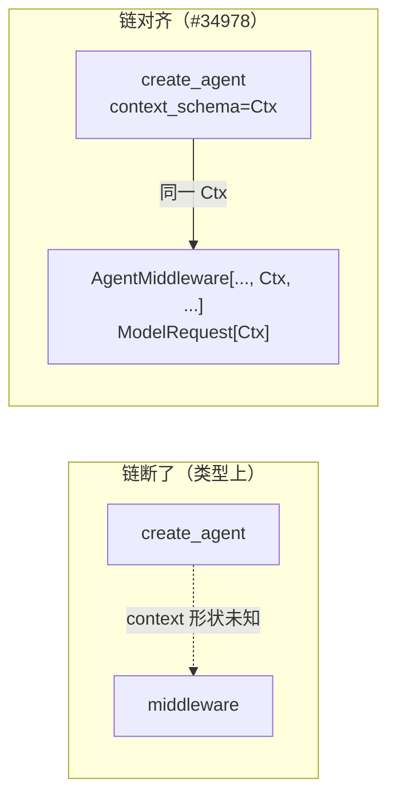

# `create_agent`、runtime context 与 `ModelRequest[ContextT]`：告警从哪来、怎么对齐

> **文档目标**：说明为什么在 **`create_agent` + 多层中间件** 项目里，编辑器里 **`create_agent` 一带就长期有警告**；这和 **LangGraph 的 `Runtime.context`**、**`ModelRequest[ContextT]`** 有什么关系；**改代码前后** 类型检查与运行时分别差在哪。  
> **阅读门槛**：写过 `AgentMiddleware`、`wrap_model_call`，知道 `invoke` / `astream` 时会传 `context`。  
> **版本提示**：下文与 LangChain PR [#34978](https://github.com/langchain-ai/langchain/pull/34978) 一致；`context_schema`、`ModelRequest` 泛型参数名以你安装的 `langchain` 为准。

**相关阅读**：  
- [OpenAI 服务端上下文压缩与 LangChain 指南](./openai-compaction-langchain-guide.md)  
- [`wrap_model_call` 的额外一次状态更新](./wrap-model-call-extra-update.md)（[#35033](https://github.com/langchain-ai/langchain/pull/35033)，与本文 **不同主题**：那边讲 `ExtendedModelResponse` + `Command`）

---

## 目录

1. [术语](#1-术语)  
2. [现象：代码能跑，`create_agent` 附近却一直有警告](#2-现象代码能跑create_agent-附近却一直有警告)  
3. [原因：`ContextT` 没在「agent 入口」和「中间件」之间穿成一条线](#3-原因contextt-没在agent-入口和中间件之间穿成一条线)  
4. [对照：改之前 vs 改之后](#4-对照改之前-vs-改之后)  
5. [源码对照：embedease-ai](#5-源码对照embedease-ai)  
6. [结构化输出与 `ResponseT`](#6-结构化输出与-responset)  
7. [和 `wrap_model_call` 额外 `Command` 的边界](#7-和-wrap_model_call-额外-command-的边界)  
8. [排错清单](#8-排错清单)

---

## 1. 术语

| 术语 | 解释 |
|------|------|
| **`Runtime[ContextT]`** | LangGraph 执行时注入的运行时对象；其中的 **`context`** 即你业务侧传入的「会话外信息」（租户、用户、渠道等）。 |
| **`ModelRequest[ContextT]`** | 中间件 `wrap_model_call` 收到的请求对象；带 **`runtime: Runtime[ContextT]`**，读 context 应从这里走。 |
| **`context_schema`** | `create_agent` 的参数之一：声明 **context 的形状**，让类型检查器与中间件泛型对齐（名称以当前 SDK 为准）。 |
| **`AgentMiddleware[StateT, ContextT, ResponseT]`** | 中间件基类三个泛型：**图状态**、**runtime context**、**结构化输出类型**。 |

---

## 2. 现象：代码能跑，`create_agent` 附近却一直有警告

常见情况：

- **`create_agent(...)` 返回值** 拿去 `invoke` / `astream` 时，**整段波浪线 / 灰字**；  
- 自定义中间件里写 **`request.runtime.context["tenant_id"]`**，Pylance 报 **Unknown**、**reportUnknownMemberType** 一类；  
- `wrap_model_call` 里用 **`response.structured_response.xxx`**，属性推断不出来。

**先要分清两类「警告」**：

| 来源 | 处理方式 |
|------|----------|
| **静态类型（Pyright / Pylance / mypy）** | 本文主要讲这类；用 **TypedDict / dataclass + `context_schema` + 中间件泛型** 对齐。 |
| **运行时 `Warning` / `DeprecationWarning`** | 查当前 **lock 里的 langchain 版本** 对应 [Releases](https://github.com/langchain-ai/langchain/releases)；与「类型波浪线」不是一回事。 |

---

## 3. 原因：`ContextT` 没在「agent 入口」和「中间件」之间穿成一条线

[#34978](https://github.com/langchain-ai/langchain/pull/34978) 关掉的 issue 核心是：**中间件拿不到与 `create_agent` 一致的 context / response 类型信息**。

实现层面的归纳：

1. **`ModelRequest` 对 `ContextT` 泛型化**，与 **`Runtime[ContextT]`** 一致。  
2. **`wrap_model_call` 的 `request` / `handler`** 使用同一套 **`ModelRequest[ContextT]`**，和 **`AgentMiddleware[..., ContextT, ...]`** 共用类型参数。  
3. **`create_agent(..., context_schema=...)`** 把你在入口声明的 context 形状，**接到** 上述链条上。

业务代码若 **只传 dict、不声明 schema、中间件也不写泛型**：运行时 **dict 照样能传**，但检查器 **无法证明** `context` 里有哪些键 → 表现为 **长期警告**。



---

## 4. 对照：改之前 vs 改之后

### 4.1 代码与结果对比（客服场景字段）

假设中间件要读：**租户 id、会话 id、渠道**（嵌入 / 管理后台 / 企业微信等）。

**改之前**

```python
from langchain.agents import create_agent

agent = create_agent(
    model=model,
    tools=tools,
    middleware=[AuditMiddleware(), LimitMiddleware()],
    system_prompt="...",
)
```

| 维度 | 结果 |
|------|------|
| 运行 | 若在 `invoke` 时仍传入含 `tenant_id` 的 `context`，**可以正常跑**。 |
| 类型 | `ModelRequest` 上的 context **无法收窄**；中间件内 `context["tenent_id"]` **拼错键** 静态检查 **拦不住**。 |

**改之后（与 PR 示例同一思路）**

```python
from typing import Any, TypedDict

from langchain.agents import create_agent
from langchain.agents.middleware import AgentMiddleware
from langchain.agents.middleware.types import AgentState, ModelRequest, ModelResponse


class ServiceRuntimeContext(TypedDict):
    """与 invoke / stream 时传入的 runtime.context 一致；字段按业务改。"""
    tenant_id: str
    conversation_id: str
    channel: str


class AuditMiddleware(AgentMiddleware[AgentState[Any], ServiceRuntimeContext, Any]):
    def wrap_model_call(
        self,
        request: ModelRequest[ServiceRuntimeContext],
        handler,
    ) -> ModelResponse[Any]:
        _ = request.runtime.context["tenant_id"]
        return handler(request)


agent = create_agent(
    model=model,
    tools=tools,
    middleware=[AuditMiddleware()],
    context_schema=ServiceRuntimeContext,
    system_prompt="...",
)
```

| 维度 | 结果 |
|------|------|
| 运行 | **前提不变**：调用图时 **`context` 里仍须带齐这些键**，否则仍是运行时错误。 |
| 类型 | `ModelRequest[ServiceRuntimeContext]` 与 **`context_schema`** 对齐，**键名补全 / 拼写错误** 可被检查器抓住。 |

PR 中还强调：**中间件期望的 `ContextT` 与 `create_agent` 的 `context_schema` 不一致**、或 **`ResponseT` 与 `response_format` 不一致** 时，**应在类型检查阶段报错**，而不是上线后才发现。

---

## 5. 我的开源项目 - 源码出现了此问题一直得不到解决：embedease-ai

下面以 [**embedease-ai**](https://github.com/congwa/embedease-ai)（FastAPI + LangGraph、多中间件、SSE）**当前 `main` 分支上的源码**为准，说明：**仓库已经在 `create_agent` 入口传了 `context_schema`，但中间件层仍按「未泛型化的 `ModelRequest` + `Any`」读 context**——这正是 §3 说的「链只接了一半」，静态检查下 **`create_agent` / 中间件 / `**agent_kwargs` 一带仍容易长期告警**。

路径均以仓库根目录书写；行号随上游变动可能偏移，以 GitHub 上文件为准。

### 5.1 入口：`create_agent` 已传 `context_schema=ChatContext`

[`backend/app/services/agent/core/factory.py`](https://github.com/congwa/embedease-ai/blob/main/backend/app/services/agent/core/factory.py) 中 `_build_single_agent` 在正常路径里构造：

```python
agent_kwargs: dict[str, Any] = {
    "model": model,
    "tools": tools,
    "system_prompt": system_prompt,
    "checkpointer": checkpointer,
    "middleware": middlewares,
    "context_schema": ChatContext,
}
# ...
agent = create_agent(**agent_kwargs)
```

要点：

| 事实 | 对类型的影响 |
|------|----------------|
| **`context_schema=ChatContext`** 已传入 | 运行时 context 形状与 LangChain 声明一致，**业务上是对的**。 |
| **`agent_kwargs` 声明为 `dict[str, Any]`** | 再 **`create_agent(**agent_kwargs)`** 时，检查器往往 **看不清** 你传了哪些关键字 → **`create_agent` 重载匹配变弱**，常见 **Unknown / partially unknown**。 |
| **`except TypeError` 回退分支** 里调用 **`create_agent` 不带 `middleware` / `context_schema`** | 老版本兼容路径下 **根本没有 schema**；若本地依赖较旧，现象更接近 §4「改之前」。 |

### 5.2 `ChatContext` 本体：Pydantic `BaseModel`

[`backend/packages/langgraph-agent-kit/src/langgraph_agent_kit/core/context.py`](https://github.com/congwa/embedease-ai/blob/main/backend/packages/langgraph-agent-kit/src/langgraph_agent_kit/core/context.py) 定义 **`ChatContext`**（节选字段含义）：

| 字段 | 用途（与中间件相关） |
|------|----------------------|
| `conversation_id` / `user_id` / `assistant_message_id` | 会话与消息锚点 |
| `emitter` | SSE / 领域事件推送（中间件高频读取） |
| `db` | 可选异步 DB 会话，供工具与编排使用 |

也就是说：**业务上 context 早已是强类型模型**，但中间件签名没有把它 **绑到 `ModelRequest[ChatContext]`** 上。

### 5.3 中间件侧：裸 `AgentMiddleware` + `ModelRequest` + `Any`

以下文件在 **同一仓库** 里可检索到一致模式：**类继承 `AgentMiddleware` 不写泛型**；`awrap_model_call` 使用 **`request: ModelRequest`**（无 `ContextT`）；读 context 时 **`getattr` 链或返回 `Any`**。

| 文件 | 典型写法 |
|------|----------|
| [`.../memory/middleware/orchestration.py`](https://github.com/congwa/embedease-ai/blob/main/backend/app/services/memory/middleware/orchestration.py) | `_get_context_from_request(request: ModelRequest) -> Any`；`MemoryOrchestrationMiddleware(AgentMiddleware)` |
| [`.../agent/middleware/llm_call_sse.py`](https://github.com/congwa/embedease-ai/blob/main/backend/app/services/agent/middleware/llm_call_sse.py) | `_get_emitter_from_request(request: ModelRequest) -> Any`，内联注释写明从 **`runtime.context (ChatContext)`** 取 `emitter`，但类型上仍是 `Any` |
| [`.../agent/middleware/logging.py`](https://github.com/congwa/embedease-ai/blob/main/backend/app/services/agent/middleware/logging.py) | `LoggingMiddleware(AgentMiddleware)`，`awrap_model_call(..., request: ModelRequest, ...)` |
| [`.../agent/middleware/todo_broadcast.py`](https://github.com/congwa/embedease-ai/blob/main/backend/app/services/agent/middleware/todo_broadcast.py) 等 | 同类 **`AgentMiddleware` + `ModelRequest`** |

单测里同样可见 **`ModelRequest` 不带类型实参**，例如 [`backend/tests/test_llm_logging_middleware.py`](https://github.com/congwa/embedease-ai/blob/main/backend/tests/test_llm_logging_middleware.py)、[`test_llm_call_sse_middleware.py`](https://github.com/congwa/embedease-ai/blob/main/backend/tests/test_llm_call_sse_middleware.py) 中 **`handler(_: ModelRequest)`**。

**结论**：**运行时代码依赖的正是 `ChatContext`（emitter、user_id 等）**，但静态类型层 **没有把 `ChatContext` 作为 `ContextT` 贯穿 `AgentMiddleware` / `ModelRequest` / `handler`**，与 [#34978](https://github.com/langchain-ai/langchain/pull/34978) 要解决的「缺口」一致，因此会出现本文 §2 描述的 **「能跑、编辑器却一直提示」**。

### 5.4 与本文 §4「改之后」的对应关系（不写具体补丁，只对照）

| 当前 embedease-ai 常见状态 | §4「改之后」期望状态 |
|----------------------------|----------------------|
| `create_agent(..., context_schema=ChatContext)` | 保留 |
| `agent_kwargs: dict[str, Any]` + `**` 展开 | 尽量改为 **显式关键字调用** 或 **TypedDict/Unpack**（视你团队规范），减少 `create_agent` 入参 Unknown |
| `class Foo(AgentMiddleware)`、`request: ModelRequest` | `AgentMiddleware[AgentState[Any], ChatContext, ...]`、`ModelRequest[ChatContext]`（`ResponseT` 若有结构化输出再收窄） |
| `_get_context_from_request(...) -> Any` | `request.runtime.context` 在泛型下可直接得到 **`ChatContext`**，减少 `getattr` + `Any` |

---

## 6. 结构化输出与 `ResponseT`

若使用 **`response_format=某个 Pydantic（或等价）模型**：

- 中间件第三个泛型应改为 **该结果类型**；  
- `wrap_model_call` 返回类型用 **`ModelResponse[YourResult]`**，便于对 **`response.structured_response`** 做属性级检查。

| 配置 | 典型收益 |
|------|----------|
| 仅对齐 `ContextT` | `runtime.context` 有键提示。 |
| 再对齐 `ResponseT` | `structured_response` 字段有提示，与 `response_format` 不一致时易被静态发现。 |

embedease-ai 中 [`factory.get_response_format_for_type`](https://github.com/congwa/embedease-ai/blob/main/backend/app/services/agent/core/factory.py) 对 `product` Agent 使用 **`ProviderStrategy(RecommendationResult, strict=True)`**；若中间件仍写 **`AgentMiddleware[..., ..., Any]`** 且返回 **`ModelResponse` 无 `RecommendationResult`**，**结构化字段的推断同样接不上**，与仅修 `ChatContext` 是同一类问题。

---

## 7. 和 `wrap_model_call` 额外 `Command` 的边界

| PR | 解决什么 |
|----|----------|
| **#34978** | **类型与签名**：`ModelRequest[ContextT]`、`create_agent` 与中间件泛型 **一致**，减轻 **create_agent 周边告警**。 |
| **#35033** | **能力**：`ExtendedModelResponse` + **`Command(update=...)`**，在 **同一 model 节点** 内 **多一次 state 更新**（见 [wrap-model-call-extra-update.md](./wrap-model-call-extra-update.md)）。 |

二者可同时用于同一项目：例如 **用 #34978 把 `ChatContext` 类型对齐**，用 #35033 **在同一轮模型后做 `RemoveMessage` 等 state 更新**。

---

## 8. 排错清单

1. **只对齐了类型、invoke 仍 KeyError**：检查 **调用时传入的 `context` 是否真的包含 TypedDict 全部必填键**。  
2. **静态检查仍报 Unknown**：确认 **所有自定义中间件** 都用了 **同一 `ContextT`**，且 **`context_schema` 无拼错**。  
3. **运行时 DeprecationWarning**：打开 [langchain releases](https://github.com/langchain-ai/langchain/releases) 对照当前小版本，勿与 Pyright 告警混谈。  
4. **与 OpenAI 请求体剪枝无关**：`previous_response_id`、compaction 影响 **HTTP payload**；本文只讲 **Python 侧 context 类型**，二者不要混为一谈（详见 [openai-compaction-langchain-guide.md](./openai-compaction-langchain-guide.md)）。

---

## 参考链接

- PR：[feat: threading context through `create_agent` flows + middleware #34978](https://github.com/langchain-ai/langchain/pull/34978)  
- Issue（已关闭）：[#33956](https://github.com/langchain-ai/langchain/issues/33956)  
- 源码对照仓库：[congwa/embedease-ai](https://github.com/congwa/embedease-ai)（文中路径以 `main` 分支为准）  
- LangChain Releases：<https://github.com/langchain-ai/langchain/releases>
