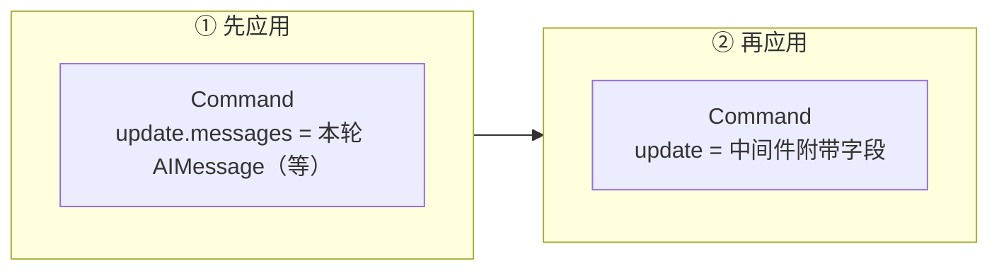
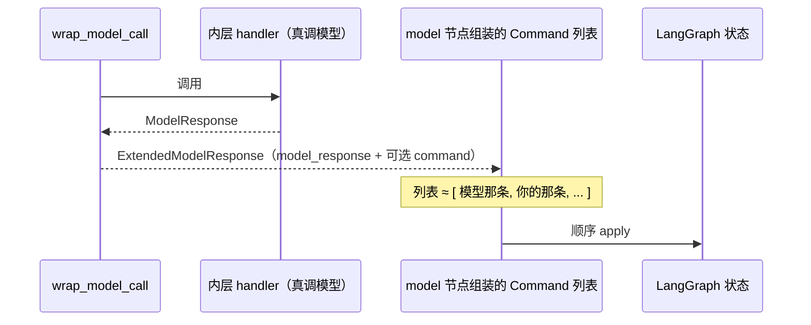
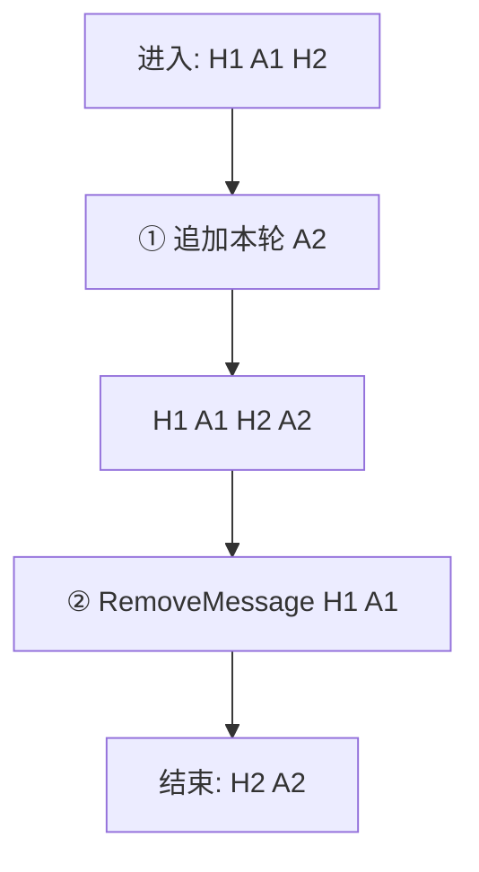
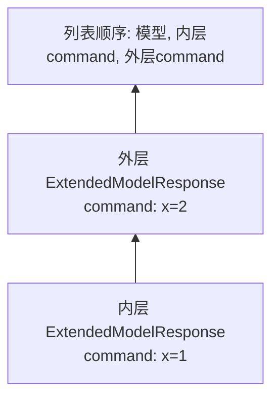

# `wrap_model_call` 的额外一次状态更新

> **文档目标**：说清楚 LangChain Agent 里 **`wrap_model_call` 为什么能多带一次状态更新**、和 **只返回 `ModelResponse` 差在哪**、**LangGraph 里实际怎么落地**、**哪些写法会报错**。读完应能自己判断：要不要用、用在哪、和别的 hook 怎么分工。  
> **阅读门槛**：已用过 `create_agent` / 中间件，知道 LangGraph 的 `state` 和 `messages` 大致干什么即可。  
> **版本提示**：下列机制来自 LangChain 合并 PR [#35033](https://github.com/langchain-ai/langchain/pull/35033) 后的行为；类型名、字段名以你安装的 `langchain` 版本为准（当前上游公开类型为 **`ExtendedModelResponse`**，内含 `model_response` 与可选 `command`）。

**相关阅读**：同仓库 [OpenAI 服务端上下文压缩与 LangChain 指南](./openai-compaction-langchain-guide.md)（讲 compaction / 剪枝策略，与本文互补）。

---

## 目录

1. [一句话：多出来的那次更新是什么](#1-一句话多出来的那次更新是什么)  
2. [以前 vs 现在（对照表）](#2-以前-vs-现在对照表)  
3. [在图里谁先谁后（建议先看图）](#3-在图里谁先谁后建议先看图)  
4. [`Command` 里哪些字段暂时不能用](#4-command-里哪些字段暂时不能用)  
5. [例子一：只多写一个自定义字段](#5-例子一只多写一个自定义字段)  
6. [例子二：同一轮里先追加 AI，再按 id 删掉旧消息](#6-例子二同一轮里先追加-ai再按-id-删掉旧消息)  
7. [例子三：两层中间件各带一个 `Command`](#7-例子三两层中间件各带一个-command)  
8. [和 `before_model` / `after_model` 的简单分工](#8-和-before_model--after_model-的简单分工)  
9. [排错与自检](#9-排错与自检)

---

## 1. 一句话：多出来的那次更新是什么

`wrap_model_call` 包住的是「这一轮调用底层模型」的过程。  
**以前**：中间件最后只能交出 **`ModelResponse`（或简写 `AIMessage`）**——等价于告诉图：**本轮模型产出的消息（和可选结构化结果）就这些**。  
**现在**：还可以再交出一个 **`langgraph.types.Command`**，里面通常是 **`update={...}`**。图在执行 **同一个 model 节点** 时，会 **先应用「模型这一轮的结果」**，再 **按顺序应用你附带的 `Command`**。

多出来的那一次，就是 **`Command(update=...)` 所代表的状态更新**（走 LangGraph 的 reducer，例如 `messages` 上的 `add_messages`）。

---

## 2. 以前 vs 现在（对照表）

| 对比项 | 额外前（只返回 `ModelResponse` / `AIMessage`） | 额外后（返回 `ExtendedModelResponse`） |
|--------|-----------------------------------------------|----------------------------------------|
| 能改 `messages` | 只能把 **本轮模型输出**放进 `result` | 同上；另外可通过 **`Command(update={"messages": [...]})`** 再提交一批消息类操作（如 `RemoveMessage`） |
| 能改别的 state 键 | **不能**（没有入口） | **能**（在 `command` 的 `update` 里写，如计数器、审计列表） |
| 与「模型真实输出」边界 | 就是 `result` | **`model_response` 专放模型输出**；附带更新放在 **`command`**，框架好做路由和结构化输出校验 |
| 旧中间件 | 不用改 | 仍只返回 `ModelResponse` 即可，行为与旧版一致 |

类型别名层面，中间件允许返回的合集在文档里常写作 **`ModelCallResult`**：`ModelResponse | AIMessage | ExtendedModelResponse`。

---

## 3. 在图里谁先谁后（建议先看图）

实现上，model 节点会构造 **命令列表**：**第一条**对应「本轮模型输出」，**后面**依次挂上各层中间件收集到的 `Command`。LangGraph 按列表顺序执行。



把「一次 `wrap_model_call` 返回」画成时间序，更直观：



**读图要点**：若你在 `command` 里也要动 `messages`，要想清楚 **和第一条里已经追加的本轮 AI 的先后顺序**——常见做法是 **第一条先把本轮 AI 放进 state**，第二条再发 `RemoveMessage` 去删旧 id（见 [§6](#6-例子二同一轮里先追加-ai再按-id-删掉旧消息)）。

---

## 4. `Command` 里哪些字段暂时不能用

`_build_commands` 会对中间件带来的 `Command` 做检查：**若带了 `goto` / `resume` / `graph`，会抛 `NotImplementedError`**。  
意图是：这条路径只承载 **普通 `update` 型状态合并**；要跳节点、中断恢复、子图调度，用框架别的机制（例如文档里会提 **`jump_to` + 其它 hook**）。

**对照**：

| 你在 `Command` 里放的 | 结果 |
|----------------------|------|
| `update={"my_key": 1}` | 正常走 reducer |
| `update={"messages": [RemoveMessage(...)]}` | 正常走 `add_messages`（前提是消息 id 策略正确） |
| `goto=...` | 报错（当前不支持） |
| `resume=...` | 报错 |
| `graph=...` | 报错 |

---

## 5. 例子一：只多写一个自定义字段

**场景**：每轮模型调用结束，想在 state 里记 **`last_model_round`**（整数自增），给 UI 或计费用；**不想**把这类信息塞进某条 `AIMessage.content`。

**额外前**：做不到——`ModelResponse` 没有字段给你写 `last_model_round`，除非改 agent state 定义并在别处维护，或污染消息内容。

**额外后**：同一轮返回 `ExtendedModelResponse`，`command=Command(update={"last_model_round": n})`。

| 时刻 | `state` 片段（示意） |
|------|---------------------|
| 进入 model 节点 | `last_model_round: 2`，`messages: [...]` |
| 仅 `ModelResponse` 结束时 | `last_model_round` **仍为 2**（没变） |
| `ExtendedModelResponse` + `Command(update={"last_model_round": 3})` 结束后 | `last_model_round: **3**`，`messages` 比进入时多本轮 AI |

```python
# 结构示意（非可运行完整 agent）
from langgraph.types import Command
from langchain.agents.middleware.types import ExtendedModelResponse, ModelResponse

def wrap_model_call(self, request, handler):
    model_response: ModelResponse = handler(request)
    n = int(request.state.get("last_model_round", 0)) + 1
    return ExtendedModelResponse(
        model_response=model_response,
        command=Command(update={"last_model_round": n}),
    )
```

---

## 6. 例子二：同一轮里先追加 AI，再按 id 删掉旧消息

**场景**：state 里 `messages` 越来越长，你想在 **每一轮模型输出落袋之后**，删掉「过期」的旧消息（滑动窗口 / 只保留最近 K 轮）。删除动作依赖 **`RemoveMessage(id=...)`**，且 **每条被删消息必须有稳定 id**。

**额外前**：本轮只能 **追加** AI；**不能在同一节点再发一批删除指令**（除非不用这条 PR 提供的通路、改去别的节点或 hook，复杂度和时序都不同）。

**额外后**：`model_response` 照常带本轮 AI；`command` 里 `update={"messages": [RemoveMessage(id="..."), ...]}`。

**同一轮结束后的 messages（示意）**：

| 阶段 | `messages` 内容（简化） |
|------|-------------------------|
| 进入 model 节点 | `[H1, A1, H2]`（均有 id） |
| 刚应用「模型那条 Command」 | `[H1, A1, H2, A2]` |
| 再应用「删除 Command」（删掉 H1、A1） | `[H2, A2]` |



**注意**：若历史里存在 **工具调用链**，删 `AIMessage` 不删对应 `ToolMessage` 会坏一致性；生产上要单独设计「成组保留」规则，本文不展开实现，只强调 **对比关系**：**额外前做不到「同节点追加 + 删除」的两段式 reducer 语义**，**额外后可以**。

---

## 7. 例子三：两层中间件各带一个 `Command`

**场景**：外层中间件写 **`outer_flag`**，内层写 **`inner_counter`**，都想在同一轮模型结束后落地。

框架会把多层的 `command` **收进一个列表**再交给 `_build_commands`；**内层先执行、外层后执行**（列表顺序 inner → outer）。对 **非 reducer、简单覆盖型字段** 来说，**同名键后写覆盖先写**——外层若与内层同键，外层赢。

**数字示意**（仅说明顺序，不代表真实 API 字段）：

| 配置 | 本轮结束后某键的值 |
|------|-------------------|
| 仅内层 `Command(update={"x": 1})` | `x = 1` |
| 内层 `x=1`，外层 `Command(update={"x": 2})` | `x = **2**`（外层在后） |



**额外前**：两层都只能改 `ModelResponse`，无法各自附带独立 `update` 块（除非合并进同一条消息，语义脏）。  
**额外后**：每层一个 `Command`，由框架按约定顺序叠上去。

---

## 8. 和 `before_model` / `after_model` 的简单分工

| Hook | 典型用途 | 和「额外一次 `Command`」对比 |
|------|----------|------------------------------|
| `before_model` | 改请求（消息列表、工具列表、system 等）再进模型 | 发生在 **调用模型之前**；不是「模型已经返回之后」再补一笔 state |
| `after_model` | 模型返回之后做副作用 | 取决于框架版本与你的编排，`jump_to` 等控制流常在这类阶段讨论 |
| `wrap_model_call` + `ExtendedModelResponse` | **包一层** `handler`，在拿到 **`ModelResponse` 之后**再决定附带什么 `Command` | **专门解决**：「输出已定，还要 **同节点、走 reducer 再改 state**」 |

选型口诀：**要改「进模型之前」的输入** → 先看 `before_model`；**要改「出模型之后、且希望和本轮输出同一批命令应用」** → 用本文这条通路。

---

## 9. 排错与自检

1. **`NotImplementedError` 提到 `goto` / `resume` / `graph`**：说明 `Command` 里带了这些字段；删掉，改用文档推荐的跳转方式。  
2. **`RemoveMessage` 不生效**：检查被删消息是否 **带 id**、id 是否与 state 里一致。  
3. **工具消息删坏对话**：对比 [§6](#6-例子二同一轮里先追加-ai再按-id-删掉旧消息) 的警告——按 **轮次 / 工具组** 设计保留集，并写单测。  
4. **和 OpenAI payload 剪枝混淆**：`previous_response_id`、compaction 等影响的是 **发往 API 的包体**；本文讲的是 **LangGraph state 里多一次 reducer 更新**。两边可以并存，但 **别假设做了一边另一边自动等价**（详见 [openai-compaction-langchain-guide.md](./openai-compaction-langchain-guide.md) 模式 A/B/C）。

---

## 参考链接

- PR：[feat: support state updates from `wrap_model_call` with command(s) #35033](https://github.com/langchain-ai/langchain/pull/35033)  
- 上游类型说明：仓库内 `langchain.agents.middleware.types` 中 **`ExtendedModelResponse`**、`ModelCallResult` 文档字符串（安装版本以本地为准）
